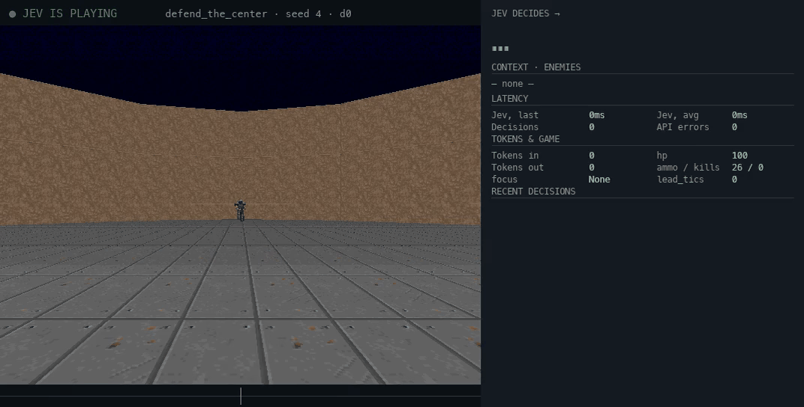

# jev-doom

VizDoom on four scenarios (`defend_the_center`, `basic`, `simpler_basic`,
`deadly_corridor`), two brains selected by flag:

- `jev` — TypeSafe's Jev (`MODEL=jev-latest`): one structured decision per
  tick (indexed target + shoot/hold + danger), no pixels. Needs an API key.
- `heuristic` — geometry-only baseline, no API key, no network, no model.
  Corridor gets the 9-button reflex bot; defend-family gets a 3-button
  aim-and-fire baseline.

```sh
uv run python -m doom.play --brain jev|heuristic --scenario defend|basic|simple|corridor
```

## Demo

<p align="center">
  
  <br />
  <sub>Jev brain, seed 5: sprint down the hallway — 1 kill, reward 1081, ~7 decisions of Doom time; skill-5 corridor ends runs fast. Full quality: <a href="assets/corridor_ep.mp4">corridor_ep.mp4</a> (a frame every 2 game-tics, 8fps).</sub>
</p>

<p align="center">
  
  <br />
  <sub>Jev brain, seed 4 re-run: 12 kills, magazine emptied, 70 decisions — indexed target + latency-gap tracking. Full quality: <a href="assets/defend_ep.mp4">defend_ep.mp4</a> (8fps).</sub>
</p>

## Quickstart

```sh
uv sync
cp .env.example .env   # then set TYPESAFE_API_KEY (jev brain only)
```

```sh
# Jev on defend (the 10.20±2.04 setup)
uv run python -m doom.play --brain jev --scenario defend --suite

# Heuristic corridor bot, no API key
uv run python -m doom.play --brain heuristic --scenario corridor --seed 1 --visible

# Full seeded suite + scoreboard (seeds 1..5, the numbers we report)
uv run python -m doom.play --brain heuristic --scenario corridor --suite
uv run python -m doom.compare --scenario corridor

# extras
uv run python -m doom.play --brain jev --scenario defend --record  # also saves frames
uv run python -m doom.human --scenario corridor  # WASD + arrows + space, you play it
uv run pytest   # offline unit tests (synthetic states, no engine)
```

Expected: episodes log to `runs/*.jsonl` (+ `.summary.json` with final
hp/ammo/kills); `compare` prints a per-seed table with mean/std.
Filenames carry brain + seed (`..._ep0_seed1.jsonl`,
`..._ep0_seed1_heuristic.jsonl`).

## How it works

Jev (`--brain jev`): 1-flight async — while the next `decide()` runs in a
background thread, code holds the last safe action; on defend-family the
~10-tic latency gap is spent tracking Jev's picked target (re-aim at
4-tic cadence, re-fire only after a `shoot` pick) instead of repeating
buttons. Snapshots carry a latency lead (`lead_tics`, EMA of gap length):
enemies dead-reckoned along velocity, facing advanced along the held turn.

Heuristic (`--brain heuristic`): synchronous encode → decide → act, every
few game-tics. No waiting, no threads, no latency gap to cover.

```
┌─────────────────────────────────────────────────────────────────┐
│  CORRIDOR HEURISTIC PIPELINE  (encode → act, ~4 tics each)      │
├─────────────────────────────────────────────────────────────────┤
│                                                                 │
│  VizDoom state                                                  │
│    objects + labels + depth buffer + game vars                  │
│      │                                                          │
│      ▼                                                          │
│  encode()  →  snapshot                                          │
│    enemies (idx, type, bearing, side, dist, range,              │
│              visible, closing), sectors, center_visible,        │
│    path (wall/open per sector, from depth), player              │
│    (hp, ammo, kills, shotgun, shells, hits_taken)               │
│      │                                                          │
│      ▼                                                          │
│  heuristic_action()  →  9-button vector + hold tics             │
│    1. opening sprint:  first 6 decisions always advance         │
│    2. cover reflex:    hit from off-screen → strafe to wall    │
│                        or face last-seen threat sector          │
│    3. bigger gun:      shotgun owned + shells → switch now      │
│    4. aim:             nearest visible shooter;                 │
│                        |bearing| ≤ 8° + ammo → fire,            │
│                        else turn toward it (4-tic holds)        │
│    5. dodge reflex:    danger ≥ 1.7 → firing strafe            │
│                        instead of standing still                │
│      │                                                          │
│      ▼                                                          │
│  press + release (pistol is semi-auto: every shot needs         │
│  a 2-tic press + 2-tic release or holds go silent)              │
│                                                                 │
└─────────────────────────────────────────────────────────────────┘
```

Geometry aims, reflexes dodge. Turn rate is ~0.44°/tic; turns use short
4-tic holds so the next decision re-aims instead of freezing mid-turn.
Locomotion always holds SPEED (free run, no stamina). Danger is 0–2:
2.0 = close enemy visible, 1.0 = something visible, 0.0 = nothing.

## Actions

**defend_the_center / basic / simple** (3 buttons: LEFT, RIGHT, ATTACK —
turns on defend, strafes on basic/simple)

| Jev question | Options | Mapping |
|---|---|---|
| target: Choice(N+1), built per snapshot | enemy `idx` … / none | turn/strafe toward that enemy, bearing-proportional, 2–4 tics; latency gap tracks it; none/invalid → alternating scan |
| fire: Choice(2) | shoot / hold (rule: `side = centered` AND `visible`) | ATTACK 2 tics + 2 release; chained bursts up to 12 tics |
| danger: Score(0–2) | — | ≥ 1.7 → single bursts only |

**deadly_corridor** (9 buttons, skill 5, 6 armed shooters)

[FWD, BACK, STRAFE_L, STRAFE_R, TURN_L, TURN_R, ATTACK (idx 6),
SELECT_WEAPON3, SPEED]

| Pick | Button vector | Hold |
|---|---|---|
| advance / retreat | FWD / BACK (+ SPEED) | 4 tics |
| strafe_left / strafe_right | strafe (+ SPEED) | 4 tics |
| turn_left / turn_right | turn | 4 tics |
| attack | ATTACK | 4 tics + release |
| strafe_left_fire / strafe_right_fire | strafe + ATTACK (+ SPEED) | 4 tics + release |
| switch_to_shotgun | SELECT_WEAPON3 | 6 tics |

Extras: opening 6-decision sprint (a scripted rush scored +495 vs −16
dodging in place), depth-buffer wall map (`path: wall/open` per sector),
monster-vs-pickup filtering via label categories (a GreenArmor once
counted as a "close enemy"), shotgun pickup + switch mid-episode
(ChaingunGuys/ShotgunGuys drop their guns).

## Results

Heuristic corridor (skill 5):

| seed | kills | bullets | reward | decisions | shots |
|---|---|---|---|---|---|
| 1 | 1 | 0 | 188 | 13 | 1 |
| 2 | 0 | 3 | 202 | 15 | 8 |
| 3 | 1 | 2 | 185 | 11 | 3 |
| 4 | 1 | 4 | 181 | 18 | 9 |
| 5 | 1 | 3 | 342 | 17 | 6 |
| mean±std | 0.80±0.40 | — | 220±62 | — | — |

Jev defend_the_center (indexed target + latency-gap tracking):

| seed | kills | bullets | acc | reward |
|---|---|---|---|---|
| 1 | 7 | 22 | 0.32 | 7 |
| 2 | 11 | 26 | 0.42 | 11 |
| 3 | 11 | 26 | 0.42 | 11 |
| 4 | 13 | 26 | 0.50 | 13 |
| 5 | 9 | 26 | 0.35 | 9 |
| mean±std | 10.20±2.04 | — | — | 10.2±2.0 |

```sh
uv run python -m doom.play --brain jev --scenario defend --suite  # seeds 1..5
uv run python -m doom.play --brain heuristic --scenario corridor --seed 1
uv run python -m doom.compare --scenario defend  # per-seed table + mean/std
```

`game.set_seed(seed)` is called before each `new_episode`; the seed lands in
log filenames and `.summary.json`.

Corridor is genuinely brutal: six hitscanners focus-firing at skill 5 melt
100hp in ~3 game-seconds in the open. Progress (not kills) is the score —
and the honest tradeoff of the heuristic: it shoots back (4/5 episodes land
kills, seed 1's kill is infighting) but fighting costs sprint progress,
so rewards (181–342) trail a pure no-fire sprint (~600+). Tactics that
matter: opening sprint, strafe-fire, never trading stationary.

## Human

Same maps, same rules:

```sh
uv run python -m doom.human --scenario corridor  # WASD move, arrows turn, Q shotgun, SHIFT run, SPACE fire
uv run python -m doom.human --scenario defend    # arrows + space
uv run python -m doom.compare
```

## Notes

- Pistol is semi-auto: every shot needs a release tic, or holds go silent.
- Turn rate is ~0.44°/tic — short 4-tic holds beat long ones (re-aim early).
- Doom's angle convention is flipped vs atan2: screen-right is negative.
  Verified against the label buffer's screen-x, not by reasoning.
- VizDoom `Object` uses `.id`, `Label` uses `.object_id`. Different structs.
- Label `object_category` (Monster vs Armor/...) filters pickups out of
  the threat list — a GreenArmor once counted as a "close enemy".
- ShotgunGuys/ChaingunGuys drop their guns: pick up the shotgun mid-episode.
- `runs/` logs are pre-action snapshots; final hp/ammo/kills come from
  game variables and are saved to `.summary.json`.
- The *game* is deterministic under a fixed seed; report suite mean/std,
  never single runs. *Jev* is not — same seed twice can differ by a
  decision or two, so compare suite mean/std.
