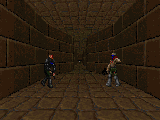

# jev-doom — Doom played by Jev

VizDoom + TypeSafe's Jev (a System One model). The game loop runs in code;
Jev makes one structured decision per tick — no text, no parsing, just typed
answers with probabilities. Jev never sees pixels: object positions, angles,
and a depth-derived wall map are encoded to JSON and sent as state.

## Gameplay (deadly_corridor, skill 5 — 2 kills)



Full quality: [assets/corridor_ep.mp4](assets/corridor_ep.mp4)
(one frame per decision, 8fps timelapse)

## Run it

```sh
uv sync
# .env holds JEV_APIKEY=... (or TYPESAFE_API_KEY)
uv run python -m doom.play --scenario corridor --episodes 2
uv run python -m doom.play --scenario corridor --record  # also saves frames
uv run python -m doom.human --scenario defend  # keyboard baseline
uv run python -m doom.compare                  # scoreboard
```

## How it works

```
VizDoom (60fps render, sync mode)
  -> every N tics: snapshot to JSON (sectors, bearings, wall map)
  -> Jev, 1 call, 2-3 questions in parallel -> discrete action
  -> confidence gating + survival reflexes in code
```

Jev decides *what*; code handles *how long* (hold tics) and safety
overrides (dodge at critical danger, ammo gates, semi-auto release).

## Action spaces

Jev only picks from a discrete set — the surrounding code maps each pick
to a button vector held for a fixed number of tics (35 tics = 1 game second).

**defend_the_center** (3 buttons: TURN_LEFT, TURN_RIGHT, ATTACK)

| Jev question | Options | Mapping |
|---|---|---|
| aim: Choice(3) | left / center / right | turn toward most threatening sector, 16 tics (~7°) |
| fire: Noul | p ≥ 0.65 + centered + ammo | ATTACK 2 tics + 2 release (semi-auto re-press) |
| danger: Score(0–2) | — | < 0.8 conf → keep sweeping last turn direction |

**basic / simpler_basic** (3 buttons: MOVE_LEFT, MOVE_RIGHT, ATTACK)

Same 3 questions, fire threshold 0.5 (50 bullets vs 400HP needs volume).
Aim maps to strafing instead of turning; goal is to strafe until the
bearing hits 0°, then fire.

**deadly_corridor** (7 buttons: FWD, BACK, STRAFE_L, STRAFE_R, TURN_L,
TURN_R, ATTACK — skill 5, 6 armed shooters)

| Jev Choice (9) | Button vector | Hold |
|---|---|---|
| advance / retreat | FWD / BACK | 8 tics |
| strafe_left / strafe_right | strafe | 8 tics |
| turn_left / turn_right | turn | 16 tics |
| attack | ATTACK | 8 tics (~2 bullets via auto-refire) |
| strafe_left_fire / strafe_right_fire | strafe + ATTACK | 8 tics |
| danger: Score(0–2) | — | ≥ 1.7 with a stationary pick → code forces a dodge |

Corridor extras: opening 6-decision sprint (learned from a scripted rush
scoring +495), depth-buffer wall map (`path: wall/open` per sector),
monster-vs-pickup filtering via label categories.

## Results (measured 2026-09-20 from Seoul, ~250–300ms/decision)

| Scenario | Best | Notes |
|---|---|---|
| defend_the_center | **4 kills** (6 bullets, 43 decisions) | kill every episode; pistol vs demons caps survival |
| simpler_basic | **win 2/2**, untouched (hp 100) | strafe-to-center, 1–2 bullets per kill |
| deadly_corridor (skill 5) | **2 kills**, reward 428 | spawn RNG dominates; death in 50–100 tics is normal |

Corridor is genuinely brutal: six hitscanners focus-firing at skill 5 melt
100hp in ~3 game-seconds in the open. Progress (not kills) is the score;
tactics that mattered: opening sprint, strafe-fire, never trading stationary.

## Cost (measured, 14-decision corridor episode)

Per decision: 794 input / 108 output tokens, 248ms.

| Model | $/MTok in | $/MTok out | Per episode | vs Jev |
|---|---|---|---|---|
| **Jev (measured)** | 0.042 | **free** | **$0.0005** | 1x |
| GPT-5.6 Luna | 0.20 | 1.20 | $0.0040 | 9x |
| GPT-5.4 Nano | 0.20 | 1.25 | $0.0041 | 9x |
| Claude Haiku 4.5 | 1.00 | 5.00 | $0.0187 | 40x |
| GPT-5.6 Terra (same intelligence tier) | 2.00 | 12.00 | $0.0403 | 86x |

At ~3.5 decisions/sec for an hour: Jev **$0.34** vs Terra $26.
LLM side assumes minimal structured JSON output (a lower bound — real
reasoning traces cost more and answer in seconds, not 250ms).
Rates: TypeSafe blog (Jev), OpenAI/Anthropic public pricing (Sep 2026).

## Human vs Jev

Same maps, same rules, winner takes the scoreboard:

```sh
uv run python -m doom.human --scenario defend  # arrows + space
uv run python -m doom.human --scenario corridor  # WASD + arrows + space
uv run python -m doom.compare
```

Score = kills / bullets / accuracy. Jev's defend record: 4 kills at 0.67
per bullet. Corridor is open season — no human score posted yet.

## Things learned (the hard way)

- Pistol is semi-auto: every shot needs a release tic, or holds go silent.
- Turn rate is ~0.44°/tic — turn holds must be long, with anti-jitter sweep.
- Doom's angle convention is flipped vs atan2: screen-right is negative.
  Verified against the label buffer's screen-x, not by reasoning.
- VizDoom `Object` uses `.id`, `Label` uses `.object_id`. Different structs.
- Label `object_category` (Monster vs Armor/...) filters pickups out of
  the threat list — a GreenArmor once counted as a "close enemy".
- basic-family monsters are glass (1–2 bullets); a +101 "mystery reward"
  turned out to be a kill bonus, not a bug.
- `runs/` logs are pre-action snapshots; final hp/ammo/kills come from
  game variables and are saved to `.summary.json`.
